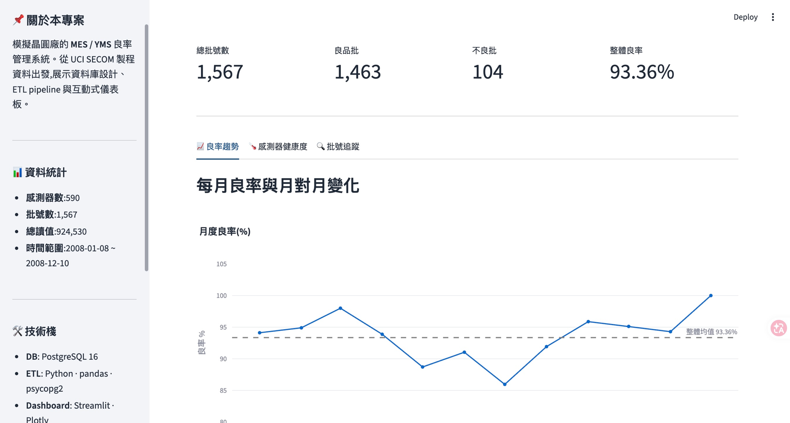
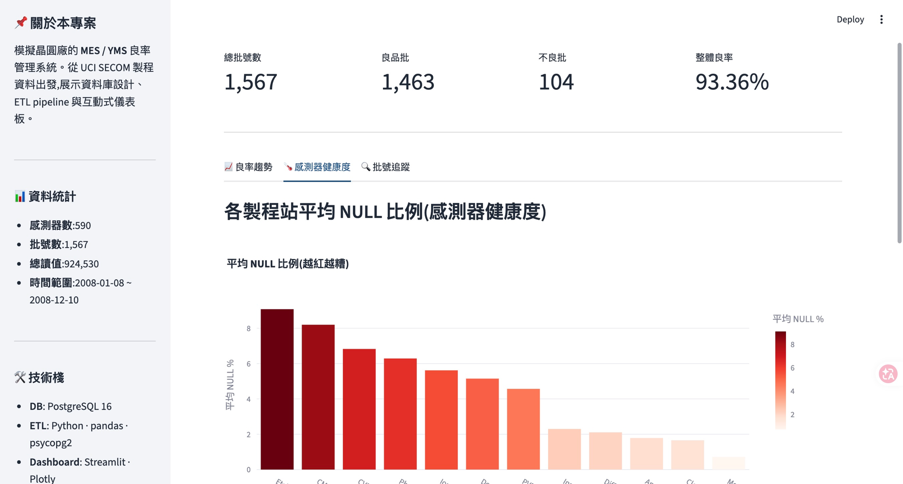
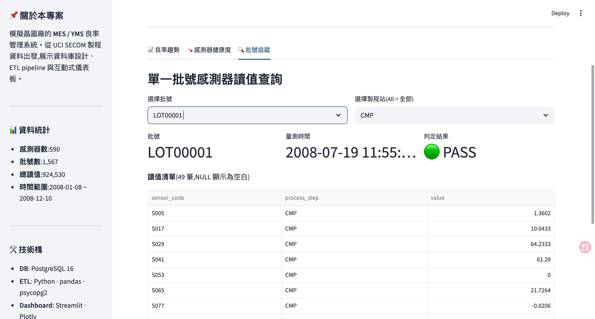

# Semicon Yield Dashboard

> 半導體製程良率分析平台 — 從 UCI SECOM 資料集出發,建構 MES/YMS 風格的關聯式資料庫與互動式儀表板。

---

## 📦 專案目標

模擬晶圓廠的良率管理系統:把製程感測器資料灌進 PostgreSQL → 用 SQL 分析 → 用 Streamlit 視覺化。

**核心問題**:
- 整體良率多少?哪一天最差?
- 590 顆感測器中,哪些對 Pass/Fail 影響最大?
- 缺失值嚴重的感測器要不要排除?

---

## 🗂️ 資料來源

| 項目 | 內容 |
|---|---|
| 資料集 | [UCI SECOM Dataset](https://www.kaggle.com/datasets/paresh2047/uci-semcom)(Kaggle) |
| 原始出處 | UCI Machine Learning Repository |
| 筆數 | 1,567 批晶圓 × 590 感測器 = **924,530 筆讀值** |
| 標籤 | Pass (-1) / Fail (+1) |
| 良率分布 | ~93.4% Pass(高度不平衡) |
| 時間範圍 | 2008-07 ~ 2008-10 |

---

## 🧩 ER Diagram

```
┌──────────────────────────────────┐         ┌──────────────────────────────────┐
│            sensors               │         │              lots                │
│  ───────────────────────────     │         │  ───────────────────────────     │
│  🔑 sensor_id     SERIAL  PK     │         │  🔑 lot_id        SERIAL   PK    │
│  ⭐ sensor_code   VARCHAR UNQ    │         │  ⭐ lot_code      VARCHAR  UNQ   │
│     sensor_name   VARCHAR        │         │     measure_time  TIMESTAMP      │
│     process_step  VARCHAR        │         │     pass_fail     SMALLINT       │
│     unit          VARCHAR        │         │     is_pass       BOOL (gen)     │
│     created_at    TIMESTAMP      │         │     created_at    TIMESTAMP      │
│                                  │         │                                  │
│         📊 590 rows              │         │         📊 1,567 rows            │
└────────────┬─────────────────────┘         └─────────────────┬────────────────┘
             │                                                 │
             │ 1                                             1 │
             │                                                 │
             │ N                                             N │
             │                                                 │
             └─────────────┬───────────────────────┬───────────┘
                           │                       │
                           ▼                       ▼
                  ┌──────────────────────────────────────────┐
                  │              sensor_data                 │
                  │  ────────────────────────────────────    │
                  │  🔑 id            BIGSERIAL  PK          │
                  │  🔗 lot_id        INT        FK → lots   │
                  │  🔗 sensor_id     INT        FK → sensors│
                  │     value         DOUBLE     (NULL ok)   │
                  │     measure_time  TIMESTAMP              │
                  │                                          │
                  │     UNIQUE (lot_id, sensor_id)           │
                  │                                          │
                  │         📊 924,530 rows                  │
                  └──────────────────────────────────────────┘
                                       ▲
                                       │
                            ┌──────────┴───────────┐
                            │   Views (derived)    │
                            │  ──────────────────  │
                            │  v_lot_full          │  ← lot 顯示友善版
                            │  v_yield_by_day      │  ← 每日良率趨勢
                            │  v_sensor_stats      │  ← 感測器 Pass/Fail 統計
                            └──────────────────────┘
```

**圖例**:
- 🔑 PK = Primary Key,自動遞增整數
- ⭐ UNQ = Unique,業務代碼(人類可讀)
- 🔗 FK = Foreign Key,串到別張表
- 📊 = 資料筆數

---

## 🎯 設計決策

| 決策 | 為什麼 |
|---|---|
| **Long format**(非寬表) | 590 顆感測器若做成欄位,新增/刪除就要 `ALTER TABLE`;長表只需 INSERT。MES 業界標準 |
| **NULL 不轉 0** | SECOM 大量 NaN = 「感測器未測到」,轉 0 會讓 `AVG()` 失真 |
| **同時有 `sensor_id` + `sensor_code`** | 數字 PK JOIN 快、字串代碼可讀;面試常考點 |
| **`is_pass` 用 GENERATED ALWAYS** | 從 `pass_fail` 自動算,避免不一致 |
| **6 個 Index** | 涵蓋 JOIN 欄位 + 時間欄;不過早加 index 但 JOIN 必加 |
| **3 個 View 預先寫好** | Streamlit dashboard 直接撈,不用每次寫複雜 SQL |

---

## 🏗️ 專案結構

```
semicon-yield-dashboard/
├── sql/
│   └── 01_schema.sql          建表 SQL:3 tables + 6 indexes + 3 views
├── etl/
│   └── 02_load_data.py        Kaggle 下載 → pandas 解析 → 批次灌庫
├── data/                       (gitignored) SECOM 原始 CSV
├── requirements.txt
├── .gitignore
└── README.md
```

---

## 🚀 快速開始

### 1. 環境準備
```bash
# PostgreSQL
brew install postgresql@16
brew services start postgresql@16

# Python 套件
pip install -r requirements.txt

# Kaggle API token (https://www.kaggle.com/settings → API)
mkdir -p ~/.kaggle && mv ~/Downloads/kaggle.json ~/.kaggle/
chmod 600 ~/.kaggle/kaggle.json
```

### 2. 建立資料庫與 Schema
```bash
createuser -s postgres
psql -d postgres -c "ALTER USER postgres WITH PASSWORD 'postgres';"
createdb -O postgres secom
psql -U postgres -d secom -f sql/01_schema.sql
```

### 3. 灌入資料
```bash
python etl/02_load_data.py
```

預期輸出:
```
✓ Inserted 590 sensors
✓ Inserted 1567 lots
✓ Inserted 924,530 sensor_data rows
✅ ETL complete.
```

---

## 📊 範例查詢

### 整體良率
```sql
SELECT
    COUNT(*)                                          AS total_lots,
    SUM(CASE WHEN is_pass THEN 1 ELSE 0 END)          AS pass_lots,
    ROUND(100.0 * SUM(CASE WHEN is_pass THEN 1 ELSE 0 END) / COUNT(*), 2) AS yield_pct
FROM lots;
-- yield_pct ≈ 93.36%
```

### 每日良率趨勢(用 view)
```sql
SELECT * FROM v_yield_by_day ORDER BY measure_date LIMIT 10;
```

### 各製程站的感測器數
```sql
SELECT process_step, COUNT(*) AS sensor_count
FROM sensors
GROUP BY process_step
ORDER BY sensor_count DESC;
```

### 找出 Pass 與 Fail 平均值差距最大的感測器(候選關鍵特徵)
```sql
SELECT sensor_code, process_step,
       ABS(avg_pass - avg_fail) AS delta
FROM v_sensor_stats
WHERE avg_pass IS NOT NULL AND avg_fail IS NOT NULL
ORDER BY delta DESC NULLS LAST
LIMIT 10;
```

---

## 📸 Dashboard Demo

Streamlit + Plotly,連 PostgreSQL,3 個互動 tab。執行:`streamlit run dashboard/app.py`

### Tab 1 · 月度良率趨勢

> 月度良率折線圖 + 月對月變化(LAG)。**7 月暴跌至 85.96%**,業界稱 Yield Excursion。

### Tab 2 · 感測器健康度

> 各製程站平均 NULL 比例(紅色越深越糟)。Etching、CMP 是高風險站。

### Tab 3 · 批號追蹤

> 互動式查詢:選批號 + 製程站 → 即時撈出該批所有感測器讀值。

---

## 🛠️ 技術棧

| 層 | 工具 |
|---|---|
| 資料庫 | PostgreSQL 16 |
| ETL | Python 3.13, pandas, numpy, psycopg2 |
| Dashboard | Streamlit · Plotly Express · 自訂 theme |
| 資料來源 | Kaggle API |
| 之後 | scikit-learn + SHAP(良率預測) |

---

## 🗺️ Roadmap

- [x] **Day 1**: Schema + ETL 完成,924K 筆讀值入庫
- [x] **Day 2**: SQL 練習 8 題(GROUP BY → CTE → Window Function)
- [x] **Day 3**: Streamlit dashboard(3 互動 tabs + sidebar + theme)
- [ ] **Day 4-5**: SQL 效能(EXPLAIN、Index)、Dashboard 更多 view
- [ ] **Day 6-7**: 整理與部署(Streamlit Cloud)
- [ ] **Week 2**: 接續 [semicon-yield-prediction](https://github.com/) — 良率 ML 預測

---

## 🎓 應用場景對照

| 本專案 | 真實 fab 廠對應 |
|---|---|
| sensors 表 | 機台感測器主檔(SECS/GEM 來源) |
| lots 表 | WIP 追蹤系統的批號 |
| sensor_data 表 | 製程資料倉儲(PDC/EDA) |
| v_yield_by_day | YMS 良率管理系統的日報 |
| ETL 腳本 | MES → DW 的批次資料管線 |
